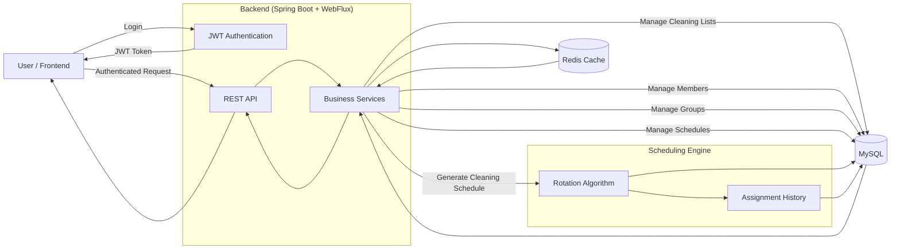

# System Flow

## Overview

The following diagram illustrates the high-level architecture and request flow of the CleanList application.

## Components

- **Frontend**: Web or mobile client used by administrators and members.
- **JWT Authentication**: Handles user authentication and authorization.
- **REST API**: Exposes application endpoints.
- **Business Services**: Contains the application's business logic.
- **Scheduling Engine**: Generates fair cleaning assignments using the rotation algorithm.
- **MySQL**: Stores application data.
- **Redis**: Improves performance by caching frequently accessed data.